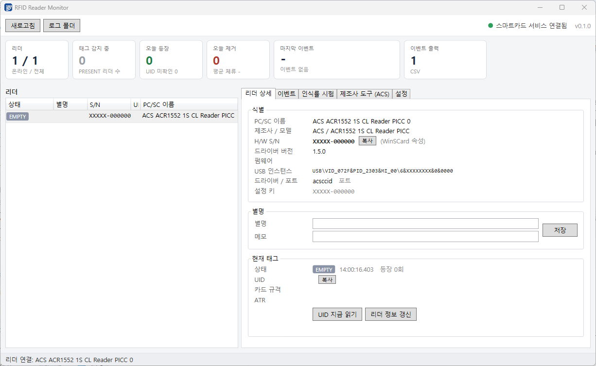

# RFID Reader Monitor

[](https://github.com/SYacuCLoud/RfidReaderMonitor/actions/workflows/build.yml)
[](https://github.com/SYacuCLoud/RfidReaderMonitor/releases)
[](LICENSE)



Windows용 PC/SC RFID 리더 점검·감시 유틸리티입니다. 연결된 리더를 나열하고, 리더 하드웨어 시리얼(S/N)에 별명을 붙이고, 태그 PRESENT/EMPTY 원신호를 디바운스해서 **등장 / 제거** 이벤트로 바꾼 뒤 CSV·TCP·명명된 파이프·SQL Server로 내보냅니다.

A Windows desktop tool for PC/SC RFID readers: lists readers, maps each reader's hardware serial to an alias, debounces card PRESENT/EMPTY signals into **appear / remove** events with dwell time, and forwards them to CSV, TCP, named pipe or SQL Server. WPF / .NET 8, no third-party PC/SC library (direct `winscard.dll` P/Invoke). UI is in Korean.

> 공정·작업대에 고정형 HF(13.56 MHz) 리더를 두고 "무엇이 언제 놓였고 언제 빠졌나"를 잡아내는 파일럿을 위해 만들었습니다. PC/SC 표준을 따르는 리더라면 제조사에 관계없이 동작하며, ACS 리더에는 전용 도구(LED·부저·폴링 설정)가 추가로 열립니다.

## 기능

| 영역 | 내용 |
|---|---|
| 리더 나열 | PC/SC 리더 목록. 뽑힘/꽂힘을 PnP 알림으로 즉시 반영, 스마트카드 서비스 중단 시 자동 재연결 |
| 하드웨어 S/N | `SCARD_ATTR_VENDOR_IFD_SERIAL_NO` → 없으면 레지스트리 `ParentIdPrefix`로 USB 부모 장치의 시리얼 → 없으면 USB 포트 경로 |
| 별명 | S/N을 키로 저장. 리더를 다른 USB 포트에 꽂아도 별명 유지. 입력 즉시 자동 저장 |
| 원신호 | `SCardGetStatusChange` 기반 PRESENT/EMPTY. 사용중(EXCLUSIVE)·무응답(MUTE)·사용불가 구분 |
| UID 읽기 | PC/SC GET DATA (`FF CA 00 00 00`). ATR로 카드 규격(ISO 14443A/B, ISO 15693, FeliCa …) 판별, ISO 15693 UID 역순 표시 옵션 |
| 디바운스 | UID를 확인해야 등장 확정(최대 1.5 s 재시도). EMPTY가 T_off 이상 지속되어야 제거 확정. T_off 안의 재등장은 무시. 제거 이벤트에 체류 시간 포함 |
| 라이브 배너·대시보드 | 최근 이벤트를 큰 글씨와 애니메이션으로 표시. 리더 수, 감지 중 리더, 오늘 등장/제거, 평균 체류, 출력 상태 타일 |
| 이벤트 출력 | CSV(일별 파일), TCP 서버(JSON 줄 단위 방송), 명명된 파이프(JSON 줄), **TCP 클라이언트(수집 서버로 전송)**, SQL Server(이벤트·호스트 상태 테이블 자동 생성) |
| 재전송 큐 | TCP 클라이언트와 SQL Server 출력은 로컬 파일 큐를 거친다. 서버·네트워크가 끊겨도 이벤트가 사라지지 않고 복구 후 순서대로 재전송 |
| 하트비트 | 주기(기본 60초)와 리더 상태 변화 시 PC 이름, 버전, 리더별 상태·UID, 오늘 건수를 상태 메시지로 보냄 |
| 수집 모드 | `--collector [포트]` 로 띄우면 여러 감시 PC의 하트비트·이벤트를 받아 PC별 타일과 통합 이벤트 목록으로 표시. 통합 CSV 기록 |
| 인식률 시험 | 지정 시간 반복 읽기 → 성공률, 최대 끊김, 응답 시간. 읽기 거리·설치 위치 조정용 |
| 제조사 도구 | 선택한 리더의 제조사에 맞는 도구만 표시. 현재 ACS: 펌웨어/S/N 조회, LED, 부저, 자동 폴링 설정, PICC 파라미터, 직접 hex 에스케이프 명령 |
| Windows 점검 | 스마트카드 PnP 정책 적용·원복, SCardSvr 상태, ACS 드라이버 EscapeCommandEnable 설정 (UAC 승격 버튼) |
| 상주 | 트레이 최소화, 단일 인스턴스, 로그인 자동 시작, `--minimized` 인자 |

## 요구 사항

- Windows 10 / 11 (x64)
- PC/SC(CCID) 호환 리더. 개발·검증은 **ACS ACR1552U**(ACS 드라이버 1.0.6)로 했습니다.
- 게시본 exe는 .NET 런타임을 포함하므로 별도 설치가 필요 없습니다. 소스 빌드에는 .NET 8 SDK 이상이 필요합니다.
- 제조사 도구(LED·부저·폴링)는 ACS 리더 전용이며, ACS 드라이버의 `EscapeCommandEnable` 레지스트리 값이 필요합니다. 프로그램 안에서 관리자 승격으로 설정할 수 있습니다.

## 설치와 실행

1. [Releases](https://github.com/SYacuCLoud/RfidReaderMonitor/releases)에서 `RfidReaderMonitor.exe`를 받아 원하는 폴더에 둡니다. 파일 하나로 동작합니다.
   - 코드 서명이 없는 실행 파일이라 처음 실행 시 Windows SmartScreen 경고가 뜰 수 있습니다. "추가 정보 → 실행"으로 진행하십시오. 배포 전 서명은 TODO에 있습니다.
2. 리더를 꽂고 실행합니다. 리더 목록에 S/N이 보이면 정상입니다.
3. **리더 상세** 탭에서 별명을 입력합니다. 0.6초 뒤 자동 저장됩니다.
4. **설정** 탭의 Windows 점검에 "스마트카드 PnP 켜짐"이 보이면 **정책 적용(관리자)** 을 누릅니다. 새 태그를 만날 때마다 Windows가 드라이버를 찾다 실패 알림을 띄우는 것을 막습니다. 원복 버튼으로 되돌릴 수 있습니다.
5. 태그를 올리고 내려서 **이벤트** 탭에 등장 → (T_off 뒤) 제거가 찍히는지 확인합니다.
6. **인식률 시험** 탭에서 태그를 정위치에 두고 30초 돌려 성공률과 최대 끊김을 확인합니다. 최대 끊김이 T_off보다 크면 태그 위치나 T_off를 조정합니다.
7. 필요한 출력(CSV/TCP/파이프/SQL)을 켜고 **설정 저장 및 출력 재구성** 을 누릅니다.

소스에서 빌드하려면:

```bash
dotnet build src/RfidReaderMonitor/RfidReaderMonitor.csproj -c Release
```

단일 exe 게시:

```bash
dotnet publish src/RfidReaderMonitor/RfidReaderMonitor.csproj -c Release -r win-x64 --self-contained -p:PublishSingleFile=true -p:IncludeNativeLibrariesForSelfExtract=true -p:EnableCompressionInSingleFile=true -o publish
```

### 릴리스

GitHub Actions(`.github/workflows/build.yml`)가 main 브랜치 push와 PR마다 빌드하고, `v*` 태그를 push하면 태그 이름을 버전으로 넣어 단일 exe를 만들어 Release에 첨부합니다. 창 상단에 표시되는 버전은 이 태그와 같습니다.

```bash
git tag v0.1.0 && git push origin v0.1.0
```

## 이벤트 형식

### JSON (TCP 서버 / 명명된 파이프)

한 이벤트가 한 줄(`\n` 종료)입니다. TCP 서버는 설정한 포트에서 접속을 받아 모든 클라이언트에 방송하고, 파이프는 `\\.\pipe\<이름>`으로 같은 내용을 보냅니다.

```json
{"time":"2026-01-15T09:12:33.421+09:00","kind":"APPEAR","reader":"1번 작업대","alias":"1번 작업대","readerName":"ACS ACR1552 1S CL Reader PICC 0","serial":"XXXXX-000000","uid":"E0 04 01 50 12 34 56 78","tech":"ISO 15693-3 / ICODE SLI","atr":"3B 8F 80 01 80 4F 0C A0 00 00 03 06 0B 00 14 00 00 00 00 77","dwellMs":null,"host":"LINE-PC-01"}
```

| 필드 | 설명 |
|---|---|
| `kind` | `APPEAR` 또는 `REMOVE` |
| `reader` | 표시용 이름. 별명이 있으면 별명, 없으면 PC/SC 이름 |
| `alias` | 설정한 별명 그대로. 없으면 빈 문자열 |
| `readerName` | PC/SC 리더 이름 |
| `serial` | 리더 하드웨어 S/N |
| `uid` | 태그 UID(16진수, 공백 구분). 읽기에 실패한 태그는 `?` |
| `tech` | ATR로 판별한 카드 규격 |
| `dwellMs` | `REMOVE`에만 존재. 등장부터 제거까지 체류 시간(ms) |

### 하트비트 (상태 메시지)

이벤트와 같은 통로(TCP 서버·파이프·TCP 클라이언트·SQL)로 주기적으로 나갑니다. `type` 으로 구분합니다.

```json
{"type":"heartbeat","time":"2026-01-15T09:12:00.000+09:00","host":"LINE-PC-01","version":"0.1.0","readers":[{"name":"ACS ACR1552 1S CL Reader PICC 0","alias":"1번 작업대","serial":"XXXXX-000000","state":"PRESENT","uid":"E0 04 01 50 12 34 56 78"}],"appearToday":12,"removeToday":11}
```

이벤트 JSON에도 `"type":"event"` 가 들어갑니다. 이벤트만 필요한 소비자는 `type` 이 `event` 인 줄만 처리하면 됩니다.

### CSV

`%LOCALAPPDATA%\RfidReaderMonitor\logs\events\events-YYYYMMDD.csv`, UTF-8(BOM).

```
time,kind,alias,readerName,serial,uid,tech,atr,dwellMs,host
```

## 여러 PC를 한 화면에서 보기 (수집 모드)

1. 보는 쪽 PC에서 수집 모드로 실행합니다. 포트를 생략하면 설정의 기본값 9760 을 씁니다.

   ```bash
   RfidReaderMonitor.exe --collector 9760
   ```

2. 각 감시 PC의 **설정 → 이벤트 출력 → 수집 PC 로 전송** 에 수집 PC 주소와 포트를 넣고 **전송 시작** 을 누릅니다. 바로 저장·적용되며 버튼 옆에 연결 상태(연결됨 / 재시도 중 / 꺼짐)와 대기 건수가 표시됩니다.
3. 수집 화면에 PC별 타일(연결 상태, 리더별 상태·UID, 오늘 건수, 마지막 이벤트)과 통합 이벤트 목록이 나타납니다. 하트비트가 3분 이상 끊기면 타일이 주황색(응답 지연), 연결이 끊기면 붉은색이 됩니다.
4. 통합 이벤트는 `%LOCALAPPDATA%\RfidReaderMonitor\logs\collector\events-YYYYMMDD.csv` 에도 기록됩니다.

수집 PC가 꺼져 있는 동안의 이벤트는 각 감시 PC의 로컬 큐(`%LOCALAPPDATA%\RfidReaderMonitor\queue`)에 남아 있다가 다시 연결되면 순서대로 전송됩니다. 감시 모드와 수집 모드는 같은 PC에서 동시에 띄울 수 있으므로, 수집 PC 주소에 `localhost` 를 넣으면 한 대로 시험할 수 있습니다.

장기 보관과 집계는 SQL Server 출력을 함께 켜서 하십시오. 하트비트는 SQL 쪽에서 `...Hosts` 테이블(이벤트 테이블 이름의 `Events` 를 `Hosts` 로 바꾼 이름)에 PC별 한 행으로 갱신됩니다.

`kind`는 `등장`/`제거`, `alias`는 비어 있을 수 있습니다. 원신호(디바운스 전)는 `logs\raw\raw-YYYYMMDD.csv`에 별도로 남습니다.

### SQL Server

설정에서 연결 문자열과 테이블 이름을 넣으면 테이블이 없을 때 자동 생성합니다.

```sql
CREATE TABLE dbo.RfidEvents (
    Id BIGINT IDENTITY(1,1) PRIMARY KEY,
    EventTime DATETIMEOFFSET(3) NOT NULL,
    Kind NVARCHAR(10) NOT NULL,          -- APPEAR / REMOVE
    ReaderAlias NVARCHAR(100) NOT NULL,
    ReaderName NVARCHAR(200) NOT NULL,
    ReaderSerial NVARCHAR(100) NULL,
    Uid NVARCHAR(64) NOT NULL,
    Tech NVARCHAR(100) NULL,
    Atr NVARCHAR(128) NULL,
    DwellMs BIGINT NULL,
    Host NVARCHAR(64) NULL
);
```

## 데이터 위치

`%LOCALAPPDATA%\RfidReaderMonitor\`

| 경로 | 내용 |
|---|---|
| `settings.json` | 별명(S/N 키), T_off, 출력 설정 |
| `logs\app-YYYYMMDD.log` | 앱 로그 (30일 보관) |
| `logs\raw\raw-YYYYMMDD.csv` | 원신호 |
| `logs\events\events-YYYYMMDD.csv` | 확정 이벤트 |

## 판정 규칙

```
PRESENT ──▶ UID 읽기 성공 ──▶ 등장 확정
        └─▶ 실패 → 80 ms 간격 재시도 (최대 1.5 s) → 그래도 실패 → UID "?" 로 등장 확정
EMPTY   ──▶ T_off(기본 1 s) 유지 ──▶ 제거 확정 (체류 시간 포함)
        └─▶ T_off 안에 같은 UID 재등장 → 무시 (들었다 놓음)
UID 를 모르는 신호(읽기 실패·사용중·무응답)는 이미 확정된 태그를 대체하지 않는다.
서로 다른 UID 가 확인되면 이전 태그 제거 → 새 태그 등장.
```

프로그램 자신의 리더 접속(UID 읽기, 속성 조회)이 만드는 INUSE/EXCLUSIVE 비트 변화는 감시 단계에서 걸러내어 되먹임을 막습니다.

## 프로젝트 구조

```
src/RfidReaderMonitor/
  Native/      winscard.dll P/Invoke
  PcSc/        컨텍스트·카드 래퍼, 감시 스레드(PcscMonitor), IRfidReaderProvider 구현
  Readers/     리더 추상화 인터페이스 (다른 하드웨어로 교체하는 지점)
  Core/        ATR 해석, UID 포맷, 디바운스 추적기(PresenceTracker), 인식률 시험
  Acs/         ACS 에스케이프 명령 정의
  Sys/         WMI·레지스트리 장치 매핑, Windows 점검, UAC 승격 실행
  Output/      이벤트 싱크(CSV/TCP/Pipe/SQL)와 디스패처
  Settings/    settings.json
  ViewModels/  MVVM (CommunityToolkit.Mvvm)
  Views/       MainWindow, AcsToolsView
```

### 다른 제조사 도구 추가

`ViewModels/AcsToolsViewModel.cs` + `Views/AcsToolsView.xaml` 짝을 참고해 같은 모양으로 만들고, `MainViewModel.UpdateVendorTools()`에서 `Vendor` 값에 따라 분기를 하나 추가하면 제조사 도구 탭에 나타납니다. 표준 PC/SC 기능은 수정 없이 그대로 동작합니다.

## 알려진 제약

- ACS 에스케이프 명령의 비트 정의는 ACR1252U 매뉴얼 기준입니다. ACR1552U의 PICC 파라미터에서 ISO 15693 비트는 추정값이며, 제조사 도구 탭의 "직접 명령"으로 실물 확인이 가능합니다.
- PC/SC는 필드 안 태그를 하나만 노출합니다. 멀티태그(안티콜리전)는 다루지 않습니다.
- 리더 속성 조회와 에스케이프 명령은 DIRECT 모드로 접속하므로, 그 순간 다른 감시자에게는 리더가 수 ms 동안 "사용불가"로 보입니다. 자체 디바운스가 흡수합니다.
- 대시보드의 오늘 통계는 메모리에만 있으며 재시작하면 0부터 셉니다. 누적 집계는 CSV나 SQL을 기준으로 하십시오.

## 라이선스

[MIT](LICENSE)
